# Linux Active Directory Domain Services (AD DS) Implementation

This repository contains the complete documentation and configuration files for deploying a **Linux-based Domain Controller** using **Samba**. This project demonstrates how to achieve full Active Directory functionality within a Linux environment.

> [!WARNING]
> This repository was created as part of a ADOS class project. While the steps documented here were successful in a controlled laboratory environment, some configurations may be incomplete or might not work as expected in a production environment. Use this information at your own risk.

---

## 📌 Introduction

The goal of this project is to implement a centralized authentication and resource management system. By using Samba as an AD DC, we provide Kerberos authentication, DNS services, and Group Policy support for a heterogeneous network.


### Technical Specifications
* **Operating Systems:**
    * **Server:** Ubuntu Server 22.04 LTS 
    * **Clients:** Ubuntu Client 22.04 LTS | Windows 10 Pro
* **Samba Version:** 4.15.x (Active Directory Domain Controller Role)
* **Domain FQDN:** `ls01.lab09.lan`

### Network Schema

> [!WARNING]
> ### 🖥️ Virtualization Environment
> This entire infrastructure was built and tested using [Oracle VM VirtualBox](https://www.virtualbox.org/). 
> * **Networking:** All nodes are connected via **VirtualBox Internal Networks**. 
> * **Implications:** This setup relies on virtual adapters. Be aware that network behavior, latency, and DHCP/DNS resolution are strictly contained within the virtual host. If you replicate this in a bridged or physical environment, IP addressing and firewall rules may require significant adjustments.
>
> To balance connectivity and isolation, each Virtual Machine is equipped with two network interfaces:
>
>1. **Bridged Interface (WAN/LAN):**
>   - **Purpose:** Provides internet access and host-machine connectivity.
>   - **Subnet:** `172.30.20.0/25`
>   
>2. **Internal Interface (LAN/Private):**
>   - **Purpose:** Dedicated private segment for Active Directory traffic and inter-VM communication.
>   - **Subnet:** `10.2.9.0/24`
>   - **VirtualBox Setting:** "Internal Network" (Intnet)

| Device | Role | IP Address (intnet) | IP Address (Bridge) |
| :--- | :--- | :--- | :--- |
| **ls09** | Domain Controller | `10.2.9.254` | `172.30.20.65`|
| **ls09t** | Domain Controller | `10.2.9.200` | `172.30.20.68`|
| **lc09** | Linux Client | `10.2.9.253` | `172.30.20.66`|
| **wc09** | Windwos Client | `10.2.9.252` | `Not asigned` |

---

# 🛠️ DC/AD Server Setup (Samba4)

In this section, we will detail the initial network configuration required to establish an Ubuntu-based Domain Controller (DC). The goal is to balance external internet access with internal domain connectivity.

## 1. 🔌 Network Interface Configuration (Netplan)

**Netplan** is the default network management tool in Ubuntu. We will configure two adapters to separate external traffic from internal domain traffic.

### Interface Definition
Edit your YAML configuration file (typically located in `/etc/netplan/`) with the following parameters:

* **`enp0s3` (Bridged Adapter):** Connects to the physical network for internet access.
    * **IP:** `172.30.20.65/25`
    * **External DNS:** `1.1.1.1` (Cloudflare)
* **`enp0s8` (Internal Network):** A private VirtualBox segment for VM-to-VM communication.
    * **IP:** `10.2.0.254/24`
    * **Local DNS:** `127.0.0.1` (Samba will act as the DNS server)
    * **Search Domain:** `lab09.lan`


> [!TIP]
> After modifying the file, apply the changes by running:
> `sudo netplan apply`

  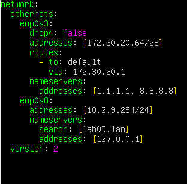 
---

## 2. 📝 Local Resolution: `/etc/hosts` File

The `/etc/hosts` file allows for manual DNS records. This is critical so the server can resolve its own identity before Samba services are fully operational.

Add the following entry to the file:

| Server IP | FQDN (Fully Qualified Domain Name) | Hostname |
| :--- | :--- | :--- |
| `10.2.0.254` | `ls09.lab09.lan` | `ls09` |

### Identity Management
* **FQDN:** The complete name on the network (Hostname + Domain).
* **Hostname:** The unique machine name. You can verify or change it using:
    ```bash
    hostnamectl                         # View current status
    sudo hostnamectl set-hostname ls09  # Change hostname
    ```

    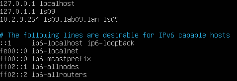

  ---

## 3. 🌐 DNS Configuration: `/etc/resolv.conf`

The `/etc/resolv.conf` file manages the system's name resolution. For an **Active Directory** environment, the server must point to itself for domain queries and to an external DNS for internet access.

Modify the file to include the following nameservers:
```text
nameserver 127.0.0.1
nameserver 1.1.1.1
```
  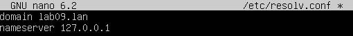 
       
## 🏗️ Domain Creation & Provisioning

First, install the necessary packages for the deployment:

 

During the installation, a configuration wizard will prompt you for the domain details. Initially, specify the **Default Realm**, which in this case is `lab09.lan`.

 

Next, you will be asked for the **Server FQDN** and the **Administrative Server**. Both fields should be configured as `ls09.lab09.lan`.

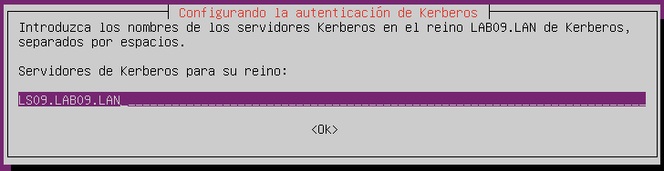 
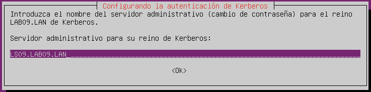 

To begin the domain provisioning, first create a backup of the existing `smb.conf` file:

 

Then, execute the following command. Specify the realm when prompted and proceed with the default options for the remaining settings:

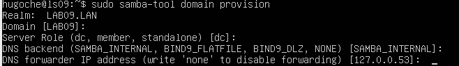 

Once finished, copy the Kerberos configuration to the `/etc` directory using the following command:

 

To ensure `samba-ad-dc` functions correctly, you must stop and disable conflicting services. Additionally, the Active Directory service must be unmasked:

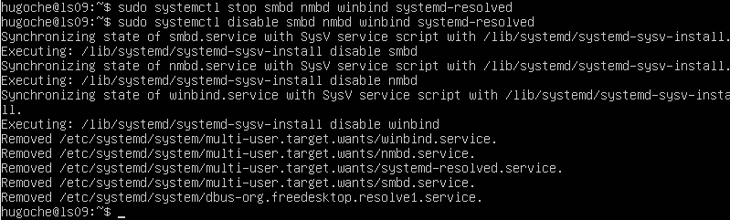 
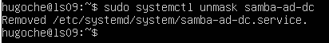 

Finally, verify that the server has been created successfully using the `samba-tool`:

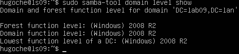
---     

## 🖥️ Adding Clients

Once the DC was operational, we integrated both Windows and Linux clients into the `lab09.lan` realm.
### Windows Client Integration

Joining a Windows client is a straightforward process, as the system includes all necessary tools by default. To complete the integration, follow these two steps:

1. **Network Adapter Configuration** The adapter must be configured within the same network segment. Assign the IP address `10.2.9.200` and set the **DNS server** to `10.2.9.254` (the server's IP address) to ensure the domain can be resolved.

   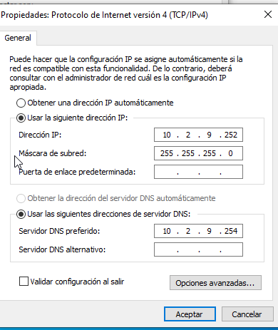 

2. **Hostname and Domain Membership** You may choose any hostname; for example, `wc09` is a suitable choice. This can be modified within the **System Properties** menu.
   
    

   In the same section, you can join the domain by selecting the **"Member of domain"** option and entering your domain name. When prompted for credentials, use the default username **Administrator** along with the domain password.

     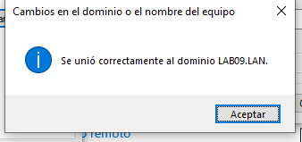 


### Linux Client Integration

To join a Linux client we will need a few steps more, first of all we will configure the network the same way that we did in windows. 

  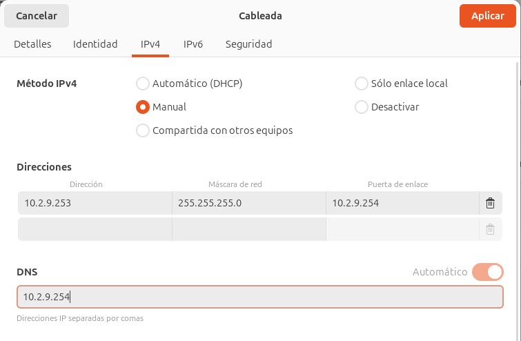 

Then we will need to install this packages:

```
sudo apt update
sudo apt install sssd-ad sssd-tools realmd adcli samba-common-bin krb5-user
```
Then we can discover the realm and try joining it

  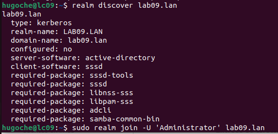 

After joining it we will need apply this command to let the server create home dirs for the samba users:

   


---

## 👥 Users and Groups Management

User and group management was performed via the CLI using `samba-tool`. This allows for granular control over the Active Directory database.

* **Create a Group:** `samba-tool group add "Management"`
* **Create a User:** `samba-tool user create "hugo"`
* **Assign Membership:** `samba-tool group addmembers "Management" "hugo"`

Verification was performed using `wbinfo -u` and `getent passwd`.

To log in with this users you will need to activate de users with `smbpasswd -e hugo`

Then you can log in using hugo@lab09.lan as user in linux or LAB09.LAN\hugo in windows.

---

## 📂 Shared Folders (File Server)

We configured network shares with specific **ACLs (Access Control Lists)** to manage permissions based on the AD groups created in the previous step.

The `smb.conf` was updated to include:

  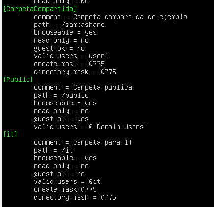 

### 📂 Configuration Breakdown: `[CarpetaCompartida]`

Each directive in the configuration defines a specific behavior or security rule for the shared resource:

* **`[CarpetaCompartida]`**: **Share Name**. This is the identifier that users will see when browsing the network.
* **`comment`**: **Description**. A brief label used to identify the share's purpose (e.g., "Carpeta compartida de ejemplo").
* **`path`**: **Local Path**. The absolute directory location on the server's filesystem (`/sambashare`).
* **`browseable`**: **Visibility**. If set to `yes`, the share appears in the network resource list; if `no`, it remains hidden.
* **`read only`**: **Write Access**. Setting this to `no` allows authorized users to create, modify, and delete files.
* **`guest ok`**: **Authentication**. When set to `no`, anonymous access is blocked, requiring a valid set of credentials.
* **`valid users`**: **User Restriction**. Defines exactly who is allowed to access the share (in this case, only `user1`).
* **`create mask`**: **File Permissions**. Automatically assigns Linux permissions (0775) to any new file created within the share.
* **`directory mask`**: **Folder Permissions**. Automatically assigns Linux permissions (0775) to any new directory created within the share.

## Domain Trust

First of all we will need to update both smb.conf adding the ip of the other server as dns forwarder:

  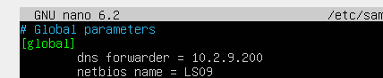 
   

Then we can create the trust with samba-tool 


  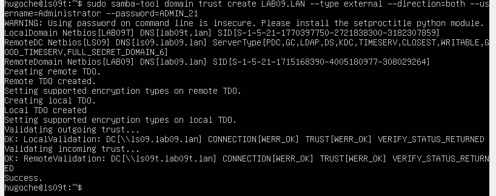 

And check if was created succesfully:

  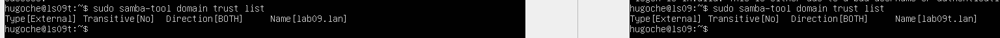 

